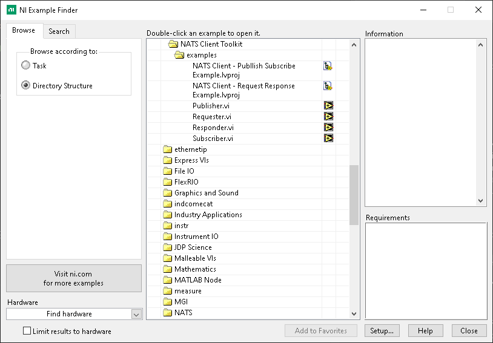

# NATS Client Toolkit

This toolkit extends [nats.lv](https://github.com/drew-herron/nats.lv) providing:

- A client daemon with queue based subscriptions for easy integration into common LabVIEW project frameworks
- JetStream publish support for lossless publishing (coming soon)!

To learn more about NATS see:

- [protocol](https://docs.nats.io/reference/reference-protocols/nats-protocol)
- [installation](https://github.com/nats-io/nats-server/releases/latest)

## Getting Started

### Installation

Install source code from VI Package Manager. See [NATS.io](https://github.com/nats-io/nats-server/releases/latest) for server installs.

#### Windows

On Windows, use the scripts in `src\NATS Insfrastructure\` instead of installing manually. These scripts are wrapped with VIs for ease of use.

##### VI

- Run `NATS Infrastructure.lvlib:NATS Server Install.vi` to install (requires internet)
- Run `NATS Infrastructure.lvlib:NATS Server Remvoe.vi` to remove

##### Command Line

```powershell
# Installs the latest nats-server release; prompts for amd64/arm64/386
.\examples\install_nats_windows.ps1

# Install to a custom directory instead of the C:\nats default
.\examples\install_nats_windows.ps1 -Arch amd64 -InstallDir "C:\somewhere-else"

# Stops any running nats-server process and removes the install + PATH entry
.\examples\remove_nats_windows.ps1
```

Both accept an `-InstallDir` param (defaults to `C:\nats`) if you need a custom location.

#### Mac

```sh
brew install nats-server
```

#### Linux

NATS provides a docker image providing an easy way to get NATS onto NI Linux Real-Time targets.

- [NI Linux RT docker installation](https://nilrt-docs.ni.com/docker/docker.html)
- [NATS docker image](https://hub.docker.com/_/nats0)

### Examples

After VI package installation navigate to NI Example Finder.



## Contributing

### Development Setup

1. Install NATS Client Toolkit.vipc
2. Install dev.vipc

### Linting and Testing

1. Run VI Analyzer using the project's [viancfg](nat.lv.viancfg)
1. Add or modify tests within `test\tests`

Test VIs within `test\tests` are automatically run using `test\caraya test runner.vi` and a resulting xml report: `test\nats.client.toolkit.xml`

### Merging Changes

1. Create a PR
1. Describe changes
1. Upload VI Analyzer and unit test results to PR
1. Request review

## License

BSD-3 [LICENSE](LICENSE)

## Acknowledgements

Thanks to Drew Herron for introducing NATS to LabVIEW with [nats.lv](https://github.com/drew-herron/nats.lv).
