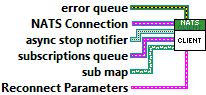
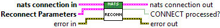
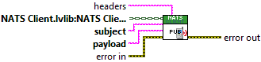

This document was created by the [PetranWay Autodocumentation Utility](https://bitbucket.org/ChrisCilino/labview-auto-documentation/src/master/).

# Charter

Empty

# Location

..\src\NATS Client\NATS Client.lvclass

# Private Data

See the [Class Report Design](https://bitbucket.org/ChrisCilino/labview-auto-documentation/wiki/User%20Documentation/Confluence%20Report%20Printouts/Class) for an explanation of [data name](https://bitbucket.org/ChrisCilino/labview-auto-documentation/wiki/User%20Documentation/Confluence%20Report%20Printouts/Class#markdown-header-private-data-name) and [type](https://bitbucket.org/ChrisCilino/labview-auto-documentation/wiki/User%20Documentation/Confluence%20Report%20Printouts/Class#markdown-header-private-data-type) syntax.

|Name|Description|Data Type|
|-|-|-|
|async stop notifier*||TypedRefNum|
|async stop notifier*.||Boolean|
|subscriptions queue*||TypedRefNum|
|subscriptions queue*.subscription queue{}||TypeDef "subscription queue": Cluster|
|subscriptions queue*.subscription queue{}.action||TypeDef "subscription actions": Enum (U16):   {0 : sub   1 : unsub}|
|subscriptions queue*.subscription queue{}.subscription||LabVIEW Class of type "NATS Subscription.lvlib:NATS Subscription.lvclass"|
|NATS Connection*||DVR Reference|
|NATS Connection*.nats connection out{}||TypeDef "nats connection": Cluster|
|NATS Connection*.nats connection out{}.connection ID||RefNum|
|NATS Connection*.nats connection out{}.server INFO||String|
|NATS Connection*.nats connection out{}.timeout ms||I32|
|NATS Connection*.nats connection out{}.verbose?||Boolean|
|NATS Connection*.nats connection out{}.server headers?||Boolean|
|NATS Connection*.nats connection out{}.client headers?||Boolean|
|subscription map*||DVR Reference|
|subscription map*.subs in||TypeDef "Subscription Map": Map|
|error queue*||TypedRefNum|
|error queue*.error out{}|**error in** can accept error information wired from VIs previously called. Use this information to decide if any functionality should be bypassed in the event of errors from other VIs.  Right-click the **error in** control on the front panel and select **Explain Error** or **Explain Warning** from the shortcut menu for more information about the error.|Cluster|
|error queue*.error out{}.status|**status** is TRUE (X) if an error occurred or FALSE (checkmark) to indicate a warning or that no error occurred.  Right-click the **error in** control on the front panel and select **Explain Error** or **Explain Warning** from the shortcut menu for more information about the error.|Boolean|
|error queue*.error out{}.code|**code** is the error or warning code.  Right-click the **error in** control on the front panel and select **Explain Error** or **Explain Warning** from the shortcut menu for more information about the error.|I32|
|error queue*.error out{}.source|**source** describes the origin of the error or warning.  Right-click the **error in** control on the front panel and select **Explain Error** or **Explain Warning** from the shortcut menu for more information about the error.|String|

# Members

|Member Name|Scope|Dynamic Dispatch|Must Override|Must Use Parent Implementation|Description \ Prototype|
|-|-|-|-|-|-|
|Register Sub|community|FALSE|FALSE|FALSE||
|Remove Sub|community|FALSE|FALSE|FALSE||
|Async|private|FALSE|FALSE|FALSE||
|| | | | |Reads a message from the NATS server.|
|Get NATS Connection|private|FALSE|FALSE|FALSE||
|Handle Subscription Requests|private|FALSE|FALSE|FALSE||
|Reconnect|private|FALSE|FALSE|FALSE||
|Resubscribe Following Reconnect|private|FALSE|FALSE|FALSE||
|Set NATS Connection|private|FALSE|FALSE|FALSE||
|Publish|public|FALSE|FALSE|FALSE||
|| | | | |Publishes subject through NATS Client.|
|Query Client Connection Status|public|FALSE|FALSE|FALSE||
|| | | | |Checks if the Client is connected to the NATS server.|
|Query Client Errors|public|FALSE|FALSE|FALSE||
|| | | | |Return Client asynchronous daemon errors.|
|Request and Wait for Response|public|FALSE|FALSE|FALSE||
|| | | | |Publishes a message and waits for a response with a blocking call.|
|Return All Subscriptions|public|FALSE|FALSE|FALSE||
|| | | | |Returns all active subscription objects.|
|Start Client|public|FALSE|FALSE|FALSE||
|| | | | |Starts the Client asynchronous daemon. The daemon must be started to use other NATS Client.lvclass methods.|
|Stop Client|public|FALSE|FALSE|FALSE||
|| | | | |Stops the Client asynchronous daemon.|
|get async stop notifier|private|FALSE|FALSE|FALSE||
|set async stop notifier|private|FALSE|FALSE|FALSE||
|Get Connection DVR|private|FALSE|FALSE|FALSE||
|Set Connection DVR|private|FALSE|FALSE|FALSE||
|Get error queue|private|FALSE|FALSE|FALSE||
|Set error queue|private|FALSE|FALSE|FALSE||
|Get subscription map|private|FALSE|FALSE|FALSE||
|Set subscription map|private|FALSE|FALSE|FALSE||
|get subscriptions queue|private|FALSE|FALSE|FALSE||
|set subscriptions queue|private|FALSE|FALSE|FALSE||
|Reconnect Parameters|community|FALSE|FALSE|FALSE||
|subscription actions|community|FALSE|FALSE|FALSE||
|Subscription Map|community|FALSE|FALSE|FALSE||
|subscription queue|community|FALSE|FALSE|FALSE||
