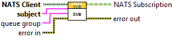
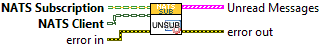

This document was created by the [PetranWay Autodocumentation Utility](https://bitbucket.org/ChrisCilino/labview-auto-documentation/src/master/).

# Charter

Empty

# Location

..\src\NATS Subscription\NATS Subscription.lvclass

# Private Data

See the [Class Report Design](https://bitbucket.org/ChrisCilino/labview-auto-documentation/wiki/User%20Documentation/Confluence%20Report%20Printouts/Class) for an explanation of [data name](https://bitbucket.org/ChrisCilino/labview-auto-documentation/wiki/User%20Documentation/Confluence%20Report%20Printouts/Class#markdown-header-private-data-name) and [type](https://bitbucket.org/ChrisCilino/labview-auto-documentation/wiki/User%20Documentation/Confluence%20Report%20Printouts/Class#markdown-header-private-data-type) syntax.

|Name|Description|Data Type|
|-|-|-|
|id||String|
|subject||String|
|reply queue*||TypedRefNum|
|reply queue*.nats message{}||TypeDef "nats message": Cluster|
|reply queue*.nats message{}.subject||String|
|reply queue*.nats message{}.payload||String|
|reply queue*.nats message{}.sub id||String|
|reply queue*.nats message{}.reply-to||String|
|reply queue*.nats message{}.headers||String|
|reply queue*.nats message{}.type||TypeDef "msg type": Enum (U16):   {0 : Undefined   1 : MSG   2 : HMSG   3 : +OK   4 : PING   5 : PONG   6 : -ERR   7 : INFO}|
|reply queue*.nats message{}.received||AbsTime|
|queue||String|

# Members

|Member Name|Scope|Dynamic Dispatch|Must Override|Must Use Parent Implementation|Description \ Prototype|
|-|-|-|-|-|-|
|Receive Response|community|FALSE|FALSE|FALSE||
|Sub|public|FALSE|FALSE|FALSE||
|| | | | |Creates and registers a subscription with the NATS Client.|
|Unsub|public|FALSE|FALSE|FALSE||
|| | | | |Unregisters a subscription with the client.|
|Wait on Response|public|FALSE|FALSE|FALSE||
|| | | | |Returns the next subscription response.|
|get id|public|FALSE|FALSE|FALSE||
|set id|private|FALSE|FALSE|FALSE||
|Get queue|public|FALSE|FALSE|FALSE||
|Set queue|private|FALSE|FALSE|FALSE||
|get reply queue|public|FALSE|FALSE|FALSE||
|set reply queue|private|FALSE|FALSE|FALSE||
|get subject|public|FALSE|FALSE|FALSE||
|set subject|private|FALSE|FALSE|FALSE||
