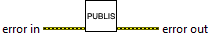
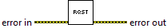
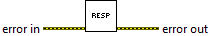

This document was created by the [PetranWay Autodocumentation Utility](https://bitbucket.org/ChrisCilino/labview-auto-documentation/src/master/).

# Charter

Empty

# Location

..\src\nats_client.lvproj

# Libraries

|Name|Description|
|-|-|
|[NATS Client](NATS-Client-Library-Documentation.md)||
|[NATS Infrastructure](NATS-Infrastructure-Library-Documentation.md)||
|[NATS Subscription](NATS-Subscription-Library-Documentation.md)||

# Classes

|Name|
|-|
|No Classes in this Library|

# Members

|Name|Description|Icon|
|-|-|-|
|Pub-Sub Example|||
|Publisher|||
|Request-Response Example|||
|Requester|||
|Responder|||
|Subscriber|||
|Client Subscription Integration Test|||
|request response test|||
|caraya test runner|||

# Controls

|Name|
|-|
|No Controls in this Project|
